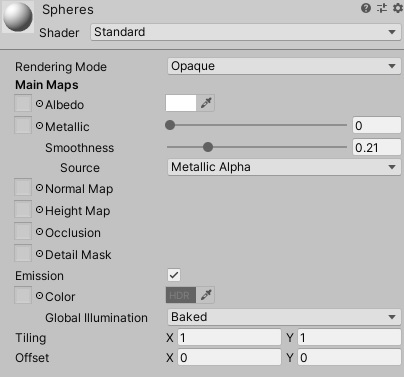
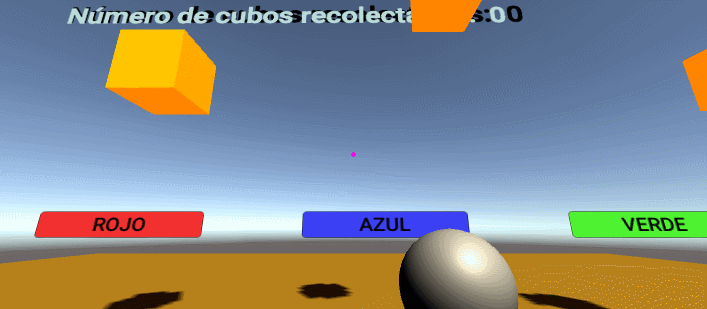
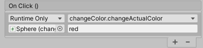
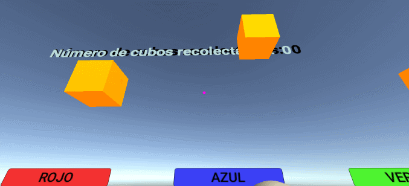

# II-Escenas_Cardboard

## Crear una aplicación Unity con cubos y esferas. Convertirla en una aplicación VR. 

Antes de comezar a resolver los distintos apartados del ejercicio, establecí la escena de trabajo como *VR* haciendo lo siguiente:

1. Creé un objeto vacío denominado **CameraRig** y le introduje como hija la **Main Camera**, a esta además, le eliminé su propiedad **PhysicsRaycaster** y la sustituí con **GvrPointerPhysicsRaycaster**.

2. A la camara, tambien le añadí como hijo el **GvrReticlePointer** y establecí que, su propiedad *Override Pointer Camera*, estuviese vinculada a la **Main Camera**.
 
3. Creé otro objeto vacío denominado **Gvr**. En él introduje el **GvrEditorEmulator**, el **GvrControllerMain** y el **GvrEventSystem**.

4. Por último, creé un objeto de tipo *Canvas*, primero sustituyendo su propiedad **Graphics Raycaster** por **GvrPointerGraphicRaycaster**, y luego, establecí las propiedades:

* *Render Mode* a *World Space*.

* *Event Camera* a **Main Camera**.

### 1. El jugador podrá cambiar de color las esferas. Inicialmente las esferas serán blancas y el nuevo color debe eligirlo entre 3 opciones en la UI.

Para resolver este apartado, lo primero que hice fue añadir un *Script* a la *Main Camera* denominado **ActualColor**, este establecía que dependiendo del color seleccionado por un botón, al observar una esfera de la escena, esta cambiaría su color al seleccionado.

Luego en el canvas, procedí a generar los elementos necesarios para la interacción. Estos fueron tres botones, cada uno con la siguiente funcionalidad en *OnClick*: 

* **Botón rojo:** Este se encarga de pasarle a la función *saveColor* del objeto *ActualColor* la cadena de carácteres *red*.

* **Botón azul:** Este se encarga de pasarle a la función *saveColor* del objeto *ActualColor* la cadena de carácteres *blue*.

* **Botón verde:** Este se encarga de pasarle a la función *saveColor* del objeto *ActualColor* la cadena de carácteres *green*.

Por último, generé las esferas en la escena: 

1. Les asigné un *Script* denominado **changeColor**, este establecía que el color inicial de las esferas sería el blanco.

2. Tambien, añadí una función denominada **changeActualColor**, esta se encargaba de comprobar en el objeto **ActualColor** el color que había sido establecido como actual y procedía a cambiarlo en el objeto *Sphere*.

3. Establecí en las esferas la propiedad *Event Trigger* con la opción *Pointer Enter* y le asigné la propia esfera y su función **changeActualColor**.

El resultado de todo lo anterior es el siguiente: 

### 2. El jugador podrá recolectar cubos.

Lo primero que hice fue generar un texto dentro del *Canvas*, éste lo situé en la esquina superior izquierda. Para que su contenido fuese actualizado, desarrollé un *Script* denominado **cubesCatch**.

También establecí un material para que los cubos tuviesen una apariencia anaranjada, y luego generé un *Prefab* del objeto **Cube**.

Para conseguir que estos fuesen eliminados al observarlos:

1. Creé un pequeño *Script* donde establecí la función *destroyCube*, esta encargandose de suprimir los cubos de la escena.

2. Añadí al *Prefab* la propiedad *Event Trigger* con la opción *Pointer Enter* de esta última. El *Prefab* quedó de la siguiente manera:

El resultado final es el siguiente:

