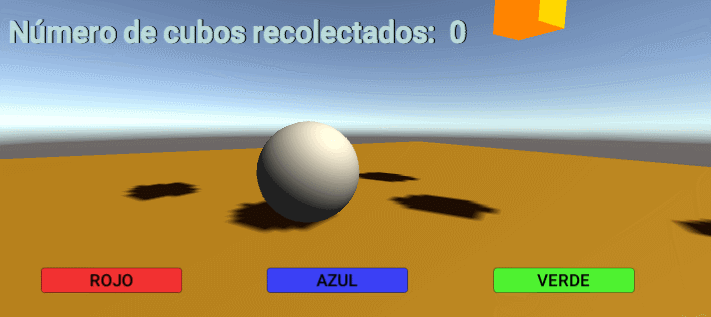

# II-Escenas_Cardboard

## Crear una aplicación Unity con cubos y esferas. Convertirla en una aplicación VR. 

### 1. El jugador podrá cambiar de color las esferas. Inicialmente las esferas serán blancas y el nuevo color debe eligirlo entre 3 opciones en la UI.

Para resolver este apartado, lo primero que realicé fue la creación de un material de color blanco común para todas las esferas.

Lo siguiente, fue la creación de objeto **Shepere**, asignandole el material anteriormente establecido, y su conversión a prefab, permitiendome así reciclarlo para el resto de objetos del mismo tipo. Además, le asigné un pequeño script que permite cambiar el color de estos objetos, denominado **changeColour**.

Luego, cree dentro de la cámara un *canvas* para poder responder al apartado de la UI. Dentro de éste, establecí tres botones, cada uno siendo correspondiente a un color primario (rojo, verde y azúl).

Por último, para poder conseguir que todas las esferas cambien al mismo color, establecí que en la función *OnClick*, de cada botón, una llamada a **changeColour**, el color al que se modificara dependedería del paramatro que se le pasase al método, quedando de la siguiente manera: 

Produciendo en el juego lo siguiente: 

### 2. El jugador podrá recolectar cubos.

Para