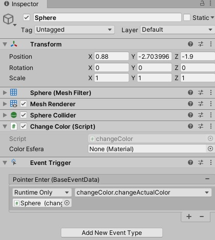
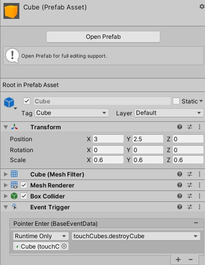

# II-Escenas_Cardboard

## Crear una aplicación Unity con cubos y esferas. Convertirla en una aplicación VR. 

### 1. El jugador podrá cambiar de color las esferas. Inicialmente las esferas serán blancas y el nuevo color debe eligirlo entre 3 opciones en la UI.

Para resolver este apartado, lo primero que realicé fue la creación de un material de color blanco común para todas las esferas.

Lo siguiente, fue la creación de objeto **Shepere**, asignandole el material anteriormente establecido, y su conversión a *prefab*, permitiendome así reciclarlo para el resto de objetos del mismo tipo. Además, le asigné un pequeño script que permite cambiar el color de estos objetos, denominado **changeColour**.

Luego, cree dentro de la cámara un *canvas* para poder responder al apartado de la UI. Dentro de éste, establecí tres botones, cada uno siendo correspondiente a un color primario (rojo, verde y azúl).

Por último, para poder conseguir que todas las esferas cambien al mismo color, establecí que en la función *OnClick*, de cada botón, una llamada a **changeColour**, el color al que se modificara dependedería del paramatro que se le pasase al método, quedando de la siguiente manera: 

Produciendo en el juego lo siguiente: 

### 2. El jugador podrá recolectar cubos.

Lo primero que hice fue crear un texto dentro del *canvas*, éste lo situé en la esquina superior izquierda. Para que su contenido fuese actualizado, desarrollé un script denominado **cubesCatch**.

Al igual que con las esferas, cree un material y, posteriormente un *prefab* del objeto **Cube**.

Para conseguir que estos fuesen eliminados al presionarlos, primero generé un pequeño script donde establecí la función *destroyCube*, esta encargandose de suprimir los cubos de la escena y, posteriormente, añadí al *prefab* la propiedad *Event Trigger*. Con la opción *Pointer Click* de esta última, hice que al ser presionado un objeto de este tipo, fuese eliminado. Quedando de la siguiente manera: 

Por último, en la *Main Camera* añandí la propiedad *Physics Raycaster*.

El resultado final es el siguiente:

